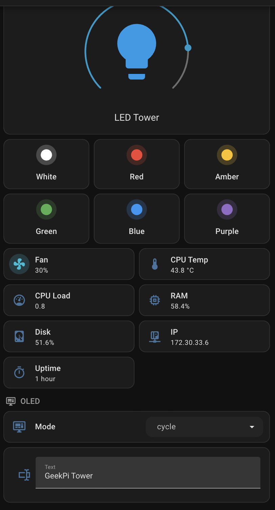
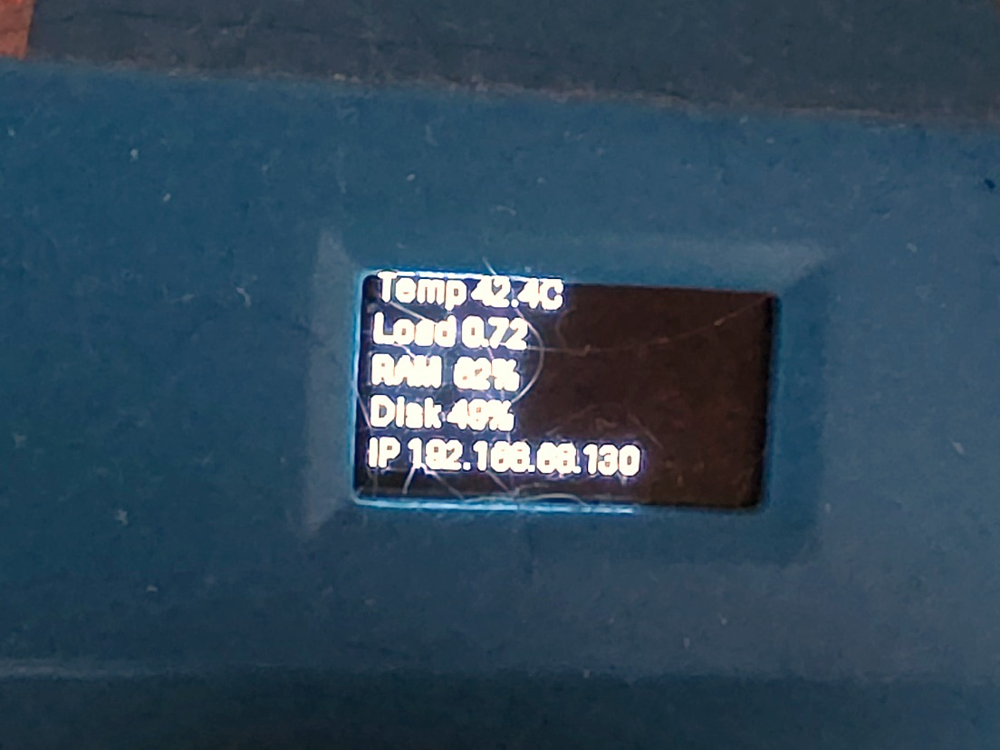
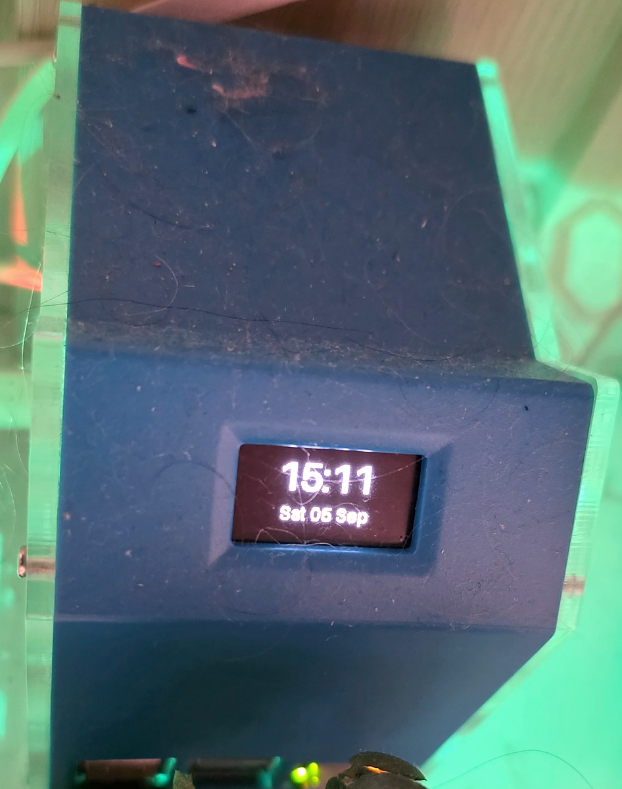
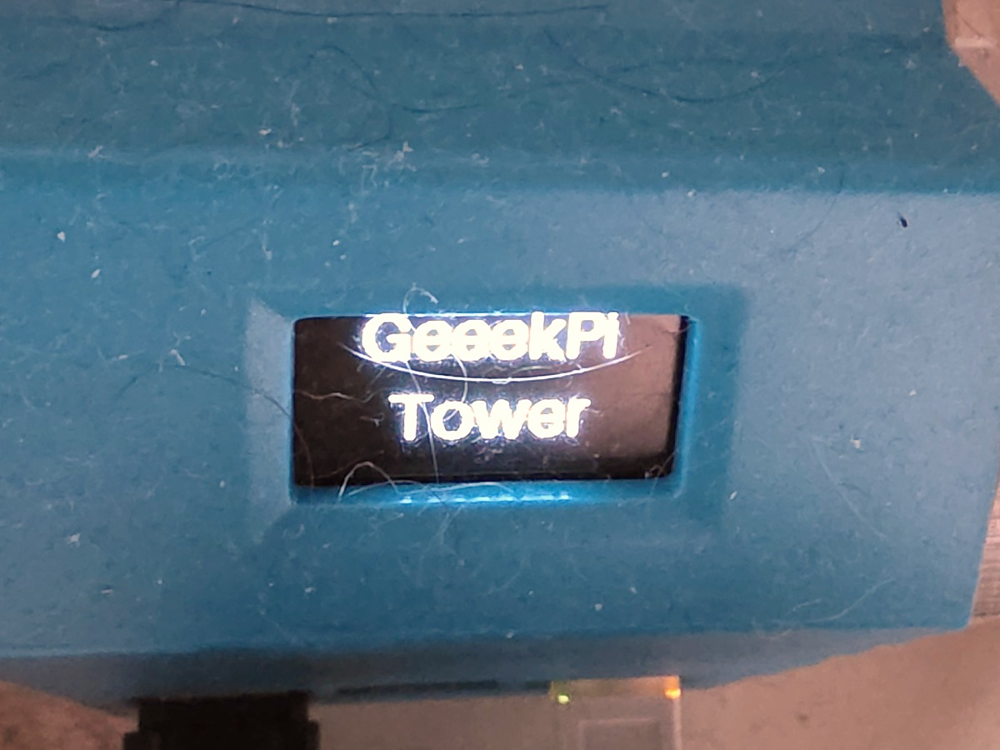

# 🖥️ Raspberry Pi Case Control

[](config.yaml)


[](../LICENSE)

Your Raspberry Pi case has a fan, some RGB LEDs and a little screen. This add-on
puts all three into Home Assistant, where you can see them and control them like
any other device.



## What it does

**The fan speeds up on its own.** Leave it in `auto` and it follows the CPU
temperature, quiet when the Pi is idle and faster when it is working. Or take
over and set the speed yourself.

**The LEDs get a proper colour picker.** Full RGB and brightness, from the
dashboard, from an automation, or from a voice assistant.

**The screen becomes useful.** System stats, a clock, or whatever text you type
into Home Assistant. It can also be switched off, which matters more than it
sounds: see [the OLED modes](#the-oled-modes).

Everything appears automatically through MQTT discovery. There is nothing to add
to `configuration.yaml`, and no entity IDs to write by hand.

## Before you install

You need two things. Neither takes long.

### 1. An MQTT broker

If you already have the **Mosquitto broker** add-on with a username and
password, you are done. If not, install it, create a user, and keep those
details for the configuration step.

### 2. I²C, but only if you want the screen

The LEDs and fan work without this. The little screen does not.

**a)** Add this line to `/boot/config.txt` on the host and reboot:

```
dtparam=i2c_arm=on
```

**b)** That switches the hardware on, but on Home Assistant OS it is not enough
on its own: the `i2c-dev` module also has to load, and nothing loads it by
default. Make that permanent:

```bash
echo i2c-dev > /etc/modules-load.d/i2c.conf
```

**c)** Check it worked. An SSD1306 screen answers at address `3c`:

```bash
i2cdetect -y 1
```

> [!NOTE]
> If you skip this the add-on still runs, the fan and LEDs work, and the log
> says the screen could not be found. Nothing breaks.

## Installing

1. Install the add-on from the store
2. Open its **Configuration** tab and fill in `mqtt_username` and
   `mqtt_password`
3. **Start** it
4. Go to **Settings → Devices** and look for **GeeekPi Tower Case**

That is it. The entities below are already there.

## What you get

| Entity | Domain | What it does |
|---|---|---|
| Tower Fan | `fan` | On/off, speed 0-100%, and an **auto** preset that follows CPU temperature |
| WS281x Tower Light | `light` | Full RGB with brightness |
| OLED Mode | `select` | `stats` · `clock` · `custom` · `cycle` · `off` |
| OLED Text | `text` | Up to 120 characters, wrapped across the screen |
| CPU Temperature, CPU Load, RAM Used, Disk Used, IP Address, Last Boot | `sensor` | System metrics, also shown on the OLED |

## Hardware

| Part | Default | Option |
|---|---|---|
| RGB LEDs | WS281x, 8 LEDs on GPIO 18 | `led_pin`, `led_count` |
| Fan | PWM on GPIO 13 | `fan_pin`, `fan_pwm_freq_hz` |
| Display | SSD1306 over I²C, address `0x3c` | `oled_i2c_bus`, `oled_i2c_address` |

Any of the three can be turned off on its own (`oled_enabled`, `fan_enabled`),
so the add-on is useful even on a case that only has a fan.

## The screen: five modes

| Mode | Shows |
|---|---|
| `stats` | CPU temperature, load, RAM, disk and IP. The default. |
| `clock` | Time in a large face, with the date under it |
| `custom` | Whatever you type into the **OLED Text** entity |
| `cycle` | Alternates `stats` and `clock` every `oled_cycle_sec` seconds |
| `off` | Blank screen |

<p>



</p>

Writing to **OLED Text** switches the mode to `custom` on its own, so the text
you just typed actually appears.

**OLED panels burn in.** This one would otherwise show the same five labels in
the same places for years. `cycle` moves the pixels and `off` rests the panel,
which is why both exist. Turning the screen off overnight from an automation
costs nothing and buys the display years.

The chosen mode and text are kept in `/data`, so they survive a restart or an
add-on update. The `oled_mode` option only seeds the very first run.

## Configuration

> [!NOTE]
> `device_name` (default `GeeekPi Tower Case`) is more than a label: Home
> Assistant derives every entity ID from it. Change it before you build
> automations or dashboards around those entity IDs, since renaming it later
> renames all of them, including in the [dashboard card](#dashboard-card)
> example below.

```yaml
mqtt_host: core-mosquitto
mqtt_username: mqtt
mqtt_password: ""          # set this in the Configuration tab

led_count: 8
led_pin: 18
led_brightness: 255

fan_enabled: true
fan_pin: 13
fan_auto_mode: true
fan_temp_min_c: 42         # below this the fan idles at fan_min_percent
fan_temp_max_c: 65         # at this it runs at fan_max_percent
fan_min_percent: 25
fan_max_percent: 100

oled_enabled: true
oled_i2c_address: "0x3c"
oled_mode: stats
oled_cycle_sec: 10
```

The full list, with types and ranges, is in `config.yaml`.

### Automatic fan control

In `auto` preset the speed is interpolated between `fan_min_percent` and
`fan_max_percent` as the CPU moves from `fan_temp_min_c` to `fan_temp_max_c`.
Setting a speed from Home Assistant switches the preset to `manual`; select
`auto` again to hand control back.

## Troubleshooting

**`OLED initialization failed: I2C device not found: /dev/i2c-1`**
The `i2c-dev` module is not loaded. See *Before installing*.

**`OLED initialization failed: I2C device not found on address: 0x3C`**
The bus works but nothing answered. Run `i2cdetect -y 1` to see what is there;
some panels sit at `0x3d` instead, which `oled_i2c_address` accepts.

**The LEDs do not light**
`led_pin` must be a pin with PWM. GPIO 18 is the usual one, and the add-on needs
`/dev/mem`, which is already declared in `config.yaml`.

**The fan never spins**
`fan_pin` must be the pin the case wires the fan to, and the fan has to support
PWM. A fan wired straight to 5V is always on and cannot be controlled.

## Dashboard card

The card in the screenshot above, ready to paste into a **sections** view.
Replace `geeekpi_tower_case` with your own device slug if you renamed the device.

```yaml
type: grid
cards:
  - type: heading
    heading: Case
    icon: mdi:server

  - type: light
    entity: light.geeekpi_tower_case_ws281x_tower_light
    name: LED Tower

  - type: grid
    columns: 3
    square: false
    cards:
      - type: tile
        entity: light.geeekpi_tower_case_ws281x_tower_light
        name: White
        icon: mdi:circle
        color: white
        vertical: true
        hide_state: true
        tap_action:
          action: perform-action
          perform_action: light.turn_on
          target:
            entity_id: light.geeekpi_tower_case_ws281x_tower_light
          data:
            rgb_color: [255, 255, 255]
      - type: tile
        entity: light.geeekpi_tower_case_ws281x_tower_light
        name: Red
        icon: mdi:circle
        color: red
        vertical: true
        hide_state: true
        tap_action:
          action: perform-action
          perform_action: light.turn_on
          target:
            entity_id: light.geeekpi_tower_case_ws281x_tower_light
          data:
            rgb_color: [255, 0, 0]
      - type: tile
        entity: light.geeekpi_tower_case_ws281x_tower_light
        name: Blue
        icon: mdi:circle
        color: blue
        vertical: true
        hide_state: true
        tap_action:
          action: perform-action
          perform_action: light.turn_on
          target:
            entity_id: light.geeekpi_tower_case_ws281x_tower_light
          data:
            rgb_color: [0, 0, 255]

  - type: tile
    entity: fan.geeekpi_tower_case_tower_fan
    name: Fan
    features:
      - type: fan-speed
      - type: fan-preset-modes
        style: dropdown
  - type: tile
    entity: sensor.geeekpi_tower_case_cpu_temperature
    name: CPU Temp
  - type: tile
    entity: sensor.geeekpi_tower_case_last_boot
    name: Uptime
    time_format: total

  - type: heading
    heading: OLED
    heading_style: subtitle
    icon: mdi:monitor-dashboard
  - type: tile
    entity: select.geeekpi_tower_case_oled_mode
    name: Mode
    features:
      - type: select-options
    features_position: inline
    hide_state: true
  - type: entities
    entities:
      - entity: text.geeekpi_tower_case_oled_text
        name: Text
```

The colour tiles take their swatch colour from the light's own state, so they
read as grey while it is off. Tapping one turns the light on in that colour.

`time_format: total` is what turns the Last Boot timestamp into an elapsed
reading rather than a date.

## Automation examples

### Rest the display overnight

The most useful automation here, because it is what keeps the panel alive.

```yaml
automation:
  - alias: OLED off at night
    triggers:
      - trigger: time
        at: "23:30:00"
    actions:
      - action: select.select_option
        target:
          entity_id: select.geeekpi_tower_case_oled_mode
        data:
          option: "off"

  - alias: OLED on in the morning
    triggers:
      - trigger: time
        at: "08:00:00"
    actions:
      - action: select.select_option
        target:
          entity_id: select.geeekpi_tower_case_oled_mode
        data:
          option: cycle
```

### Show something on the screen

Writing text switches the mode to `custom` on its own, so one action is enough.

```yaml
automation:
  - alias: Announce the doorbell on the case
    triggers:
      - trigger: state
        entity_id: binary_sensor.doorbell
        to: "on"
    actions:
      - action: text.set_value
        target:
          entity_id: text.geeekpi_tower_case_oled_text
        data:
          value: "Someone at the door"
      - delay: "00:00:30"
      - action: select.select_option
        target:
          entity_id: select.geeekpi_tower_case_oled_mode
        data:
          option: cycle
```

### Warn with the LEDs

```yaml
automation:
  - alias: Red LEDs when the Pi runs hot
    triggers:
      - trigger: numeric_state
        entity_id: sensor.geeekpi_tower_case_cpu_temperature
        above: 70
        for: "00:02:00"
    actions:
      - action: light.turn_on
        target:
          entity_id: light.geeekpi_tower_case_ws281x_tower_light
        data:
          rgb_color: [255, 0, 0]
          brightness: 255
```

The fan already reacts to temperature on its own in `auto` preset; this is for
when you want to see it from across the room.

## Credits

Written for a GeeekPi Mini Tower on a Raspberry Pi 4 running Home Assistant OS.
Uses [`rpi_ws281x`](https://github.com/jgarff/rpi_ws281x),
[`luma.oled`](https://github.com/rm-hull/luma.oled) and
[`python-periphery`](https://github.com/vsergeev/python-periphery).
